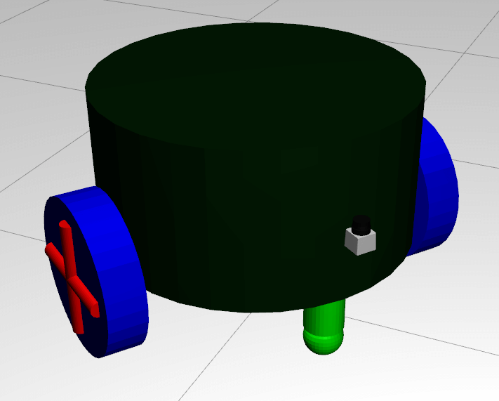
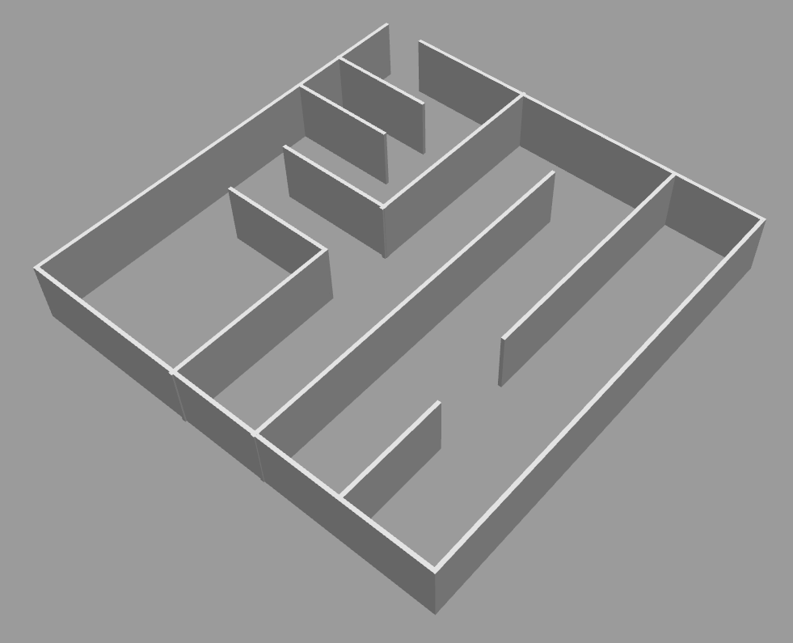

# ROS 2D Navigation Example

This respository contains example code, configuration, and launch files to demonstrate how to use the ROS navigation stack using a Gazebo simulation.

The contents of this repository are meant to accompany lectures on the topic.
The official documentation for the ROS navigation stack is available here: [http://wiki.ros.org/navigation](http://wiki.ros.org/navigation). This is a good resource to use to expand upon the example code in this repository to implement the navigation on a real robot.

## `diff_robot_gazebo` Package

This package implements a differential drive robot model for Gazebo and implements a simulated drive control system.
The drive control plugin emulates a similar ROS topic interface to drive control systems on real robots.



In addition to the Gazebo robot model, this package contains a launch file called `run_simulation.launch` that starts Gazebo and spawns the robot model.
By default, it also loads a world containing a maze for the vehicle to navigate:



There are a few arguments to `run_simulation.launch`, but the one that is meant to be changed from default is the `ground_truth_mode` argument.

```
roslaunch diff_robot_gazebo run_simulation.launch ground_truth_mode:=true
```
or
```
roslaunch diff_robot_gazebo run_simulation.launch ground_truth_mode:=false
```

When `ground_truth_mode` is set to `true`, a TF frame and corresponding `nav_msgs/Odometry` message is published for the vehicle's current position and orientation relative to its position in the Gazebo world.
This represents ideal ground truth localization information that can be used to focus on path planning algorithms without having to worry about localization.

When `ground_truth_mode` is set to `false`, the TF frame and odometry message are not published at all. To successfully navigate the maze in this mode, a localization system using LIDAR SLAM is necessary.